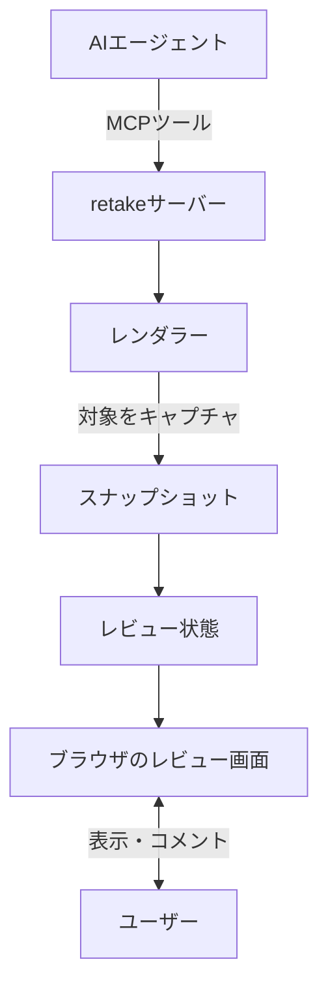

# アーキテクチャ

[English](ARCHITECTURE.md) · 日本語

retakeがレビュー対象を画面へ表示し、コメントをエージェントへ返すまでの流れを説明します

## 全体の構成

retakeは、エージェントとレビュー画面の間をつなぐローカルサーバーとして動作します

- **retakeサーバー**: エージェントからMCPツールの呼び出しを受け、レビュー全体を管理します
- **レンダラー**: Markdown、画像、コード、PDFなどをレビュー用のスナップショットへ変換します
- **レビュー状態**: スナップショット、リビジョン、コメントをMCPプロセスのメモリ上に保持します
- **レビュー画面**: ローカルのブラウザでスナップショットを表示し、範囲指定やコメント入力を受け付けます

WebページやMarkdownなど、ブラウザでの描画が必要な対象は`workers/web-capture/`のPlaywright workerがキャプチャします

## レビューの流れ

1. エージェントが`open_review`を呼び、レビュー対象をキャプチャします
2. retakeがレビュー画面を開き、エージェントは`wait_review`で送信を待ちます
3. ユーザーが位置や範囲を選んでコメントし、レビューを送信します
4. エージェントがコメントを受け取り、修正状況を`review_message`で画面へ伝えます
5. 修正後、エージェントが`update_review`を呼び、新しいリビジョンを追加してレビュー画面を前面に戻します
6. ユーザーが同じ画面で修正前後を比較し、必要なら追加のコメントを送信します

エージェントから質問する場合は、`kind: "question"`の`review_message`と`wait_reply`を使います。レビューはMCPを再起動すると終了します

## 待機状態

`wait_review`はユーザーの操作を待ち、次のいずれかの`status`を返します

| `status` | 意味 |
| --- | --- |
| `pending` | まだレビューが送信されていません。待機時間が終了したため、エージェントはもう一度`wait_review`を呼びます |
| `submitted` | コメントが送信されました。エージェントは内容を確認して修正します |
| `cancelled` | ユーザーがレビューをキャンセルしました |
| `chat` | ユーザーが元のエージェント会話での続行を選びました |

エージェントの応答が終了すると、その応答をMCPから後で再開することはできません。このため、`open_review`や`update_review`を呼んだ応答の中で、そのまま`wait_review`を開始します

## スナップショットと比較

レンダラーがキャプチャした内容をスナップショット、修正ごとに追加される一組のスナップショットをリビジョンと呼びます

レビュー画面では、選択した過去のリビジョンと最新版を次の方法で比較できます

- 左右に並べて比較
- スライダーで表示範囲を切り替えて比較
- 対応している対象をピクセル差分で比較

各レンダラーの挙動と制限は[レビュー対象とレンダラー](RENDERERS.ja.md)を参照してください

## セキュリティ上の考慮事項

- レビューサーバーはローカルホストの`127.0.0.1`だけで待ち受けます
- レビューURLにはアクセストークンが含まれるため、ログ、ソースコード、コミット、Issueへ記録しないでください
- 端末固有のMCP設定は、プロジェクトではなく各エージェントのユーザー設定へ保存してください
